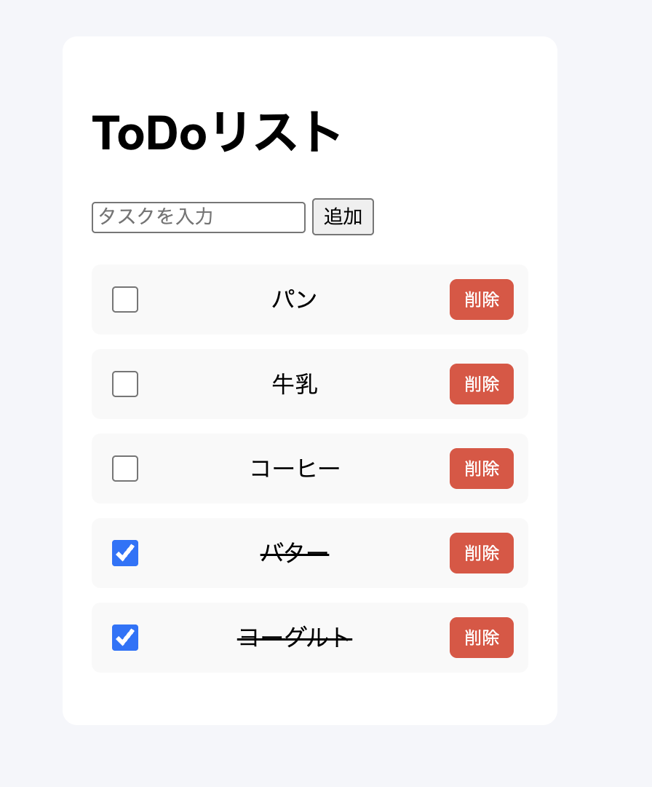

# Python Flask ToDoアプリ

個人開発で作成した、シンプルな Web 上のタスク管理アプリです。タスクの追加・削除・完了切替・入力バリデーションなどの機能を備えています。

## 機能
- タスク追加・削除
- 完了チェックボックスで完了状態切替
- 取り消し線で完了表示
- 入力バリデーション（空白・文字数制限）
- JSON ファイルに保存してデータ永続化

## 使用技術
- Python 3
- Flask
- HTML / CSS
- Git / GitHub

## デモ


## 実行方法
1. リポジトリをクローン
[GitHub リポジトリはこちら](https://github.com/yoshikawahazuki/todo-app.git)
```bash
git clone https://github.com/yoshikawahazuki/todo-app.git
cd todo-app
```
2. 仮想環境を作成して有効化
```bash
python3 -m venv venv
source venv/bin/activate
```
3. Flask をインストール
```bash
pip install flask
```
4. サーバーを起動
```bash
python3 app.py
```
5. ブラウザでアクセス
```
http://127.0.0.1:5000
```